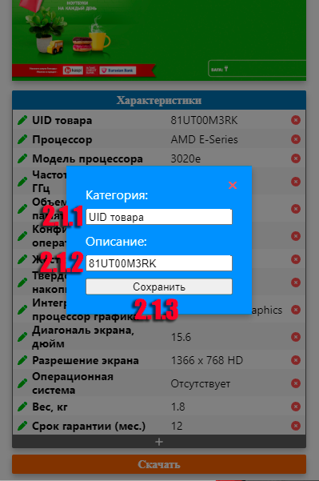

#  Генератор Рекламы для shop.kz

admaker это небольшое расширения для хрома помогающее быстро создавать рекламу для витрины магазинов shop.kz как в ручную для отдельных товаров, так и с помощью нового сервиса "shop.kz/slides"

## Руководство Пользователя

### Ручное создание рекламы

  
  Открыв артикул желаемого товара на сайте shop.kz, вы можете заметить чекбоксы слева от наименований характеристик товара. По умолчанию ими отмечены базовые характеристики товара необходимые для выставления на ветрину в целях ускорения процесса, но вы можете сами выстовлять или убирать характеристики необходимые для ваших слайдов.
  После того как вы выбрали необходимые для витрины характеристики товара, нажмите на иконку расширения в правом верхнем углу браузера, сразу после адресной строки (Если его там нет: нажмите на значок пазла и в сплывающем окне вы можете найти иконку расширения).
  

Разберем по порядку эллементы интерфейса:

  

  
  
  

  1. Меню выбора категории товара
     В этом выподающем меню вы можете выбрать к какой категории принадлежит выбранный ноутбук / Моноблок, чаще всего это делается автоматически, но если по какой то причине вас не удовлетворяет выбранная категория вы всегда можете поменять её вручную.
     Ниже выподающего меню расположен пример слайда выбранной категории.
  2. Список Характеристик товара
   Здесь расположен основной список того что будет на слайдах: все отмеченные чекбоксом на странице товара характеристики.
   Каждый элемент этого списка можно редактировать нажав на зеленую иконку карандаша слева от наименование характеристики(2.1): При нажатии всплывет окно с наименованием(2.1.1) и значением(2.1.2) характеристики которые вы можете редактировать и нажать "Сохранить"(2.1.3).

   
   Элементы можно удолять нажав на красный крестик справа от значения характеристики(2.2).
   Очередность характеристик в списке меняется простым перетаскиванием их левой кнопкой мыши.
   Внизу списка характеристик расположена кнопка добавления (2.3) - она служит для доваления кастомной характеристики которой нет на сайте. При нажатии на кнопку добавления появиться окошко с полем наименования характеристики(2.3.1) и значения характеристики(2.3.2), а также кнопкой "Сохранить"(2.3.3) добавляющей новую характеристику в конец списка.

  3. Кнопка скачивания слайдов рекламы
   После того как вы настоили желаемый вид слайдов товара, вы можете скачать архив со слайдами нажав на кнопку "Скачать" в самом низу интерфейса.

### Создание рекламы с помощью "shop.kz/slides"

Создание рекламы с помощью нового сервиса /slides, довольно простое. Это расширение добавляет кнопку "Скачать слайды". После того как вы ввели артикулы нужных вам товаров и создали слайды с помощью сервиса /slides, вы можете нажать на кнопку "Скачать слайды" расположенную справа от кнопки "Создать слайды". При нажатии будет скачан архив со всеми слайдами рассартированными в отдельные папки с именем артикула тавара, а также дополнительные слайды необходимые для рекламы товара (Акции и Банкинги)

## Устанновка

[**Chrome** Расширение](https://chrome.google.com/webstore/detail/shopkz-admaker/jppdoeeahgmlocjjeedjldfmohjomcoa?hl=ru) <!-- TODO: Add chrome extension link inside parenthesis -->

## Contribution

Suggestions and pull requests are welcomed!.

---

This project was bootstrapped with [Chrome Extension CLI](https://github.com/dutiyesh/chrome-extension-cli)
